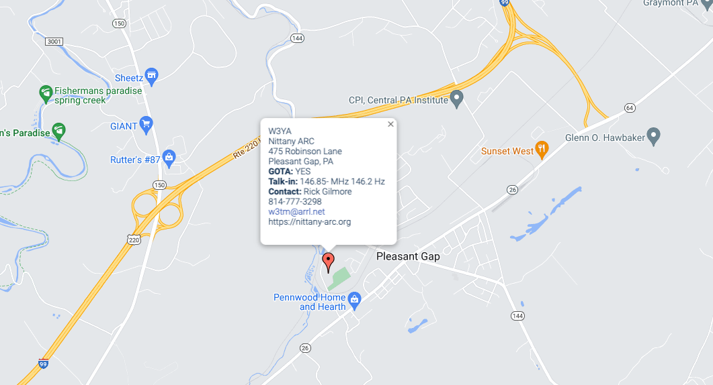
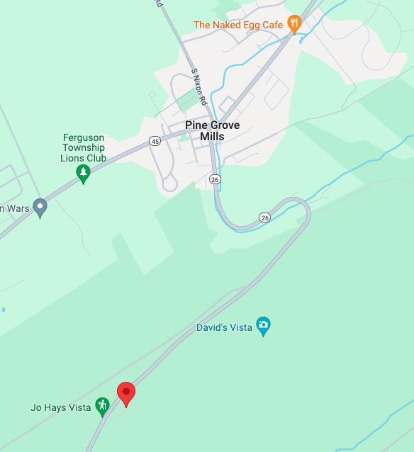

Field Day is an event organized by the [American Radio Relay League (ARRL)](https://arrl.org), the membership organization for amateur radio operators (hams) in the U.S.

Field Day is an open house to show-off amateur radio to the public, an exercise in portable or field radio operations, and a contest to see which stations can earn the most points.

NARC will operate under the club callsign [W3YA](https://qrz.com/db/w3ya) with one or two high frequency (HF) transmitters capable of long-distance communication.

We may have a bonus VHF/UHF station depending on member interest.

We will operate from the Pleasant Gap Fire Company Carnival Grounds at 375 Robinson Lane in Pleasant Gap, PA.

::: {.callout-important}
## Important details

Field Day 2026 runs from 2:00 pm (EDT) on Saturday, June 27 to 2:00 pm on Sunday, June 28, 2026.

Please visit!

:::

<!-- We will operate from our clubhouse location on top of Pine Grove Mountain off of State Route 26, making this a class 2D (two delta) operation. -->

<!-- {fig-align="center"} -->
