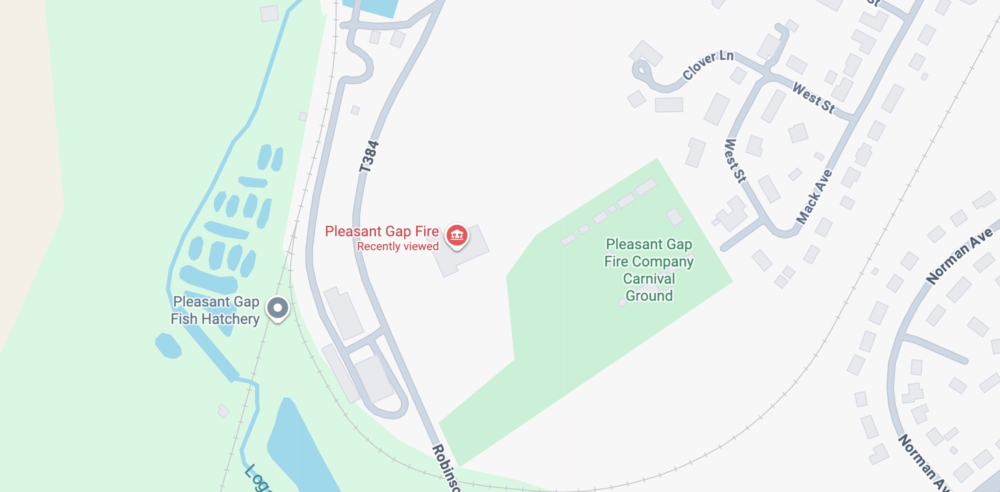
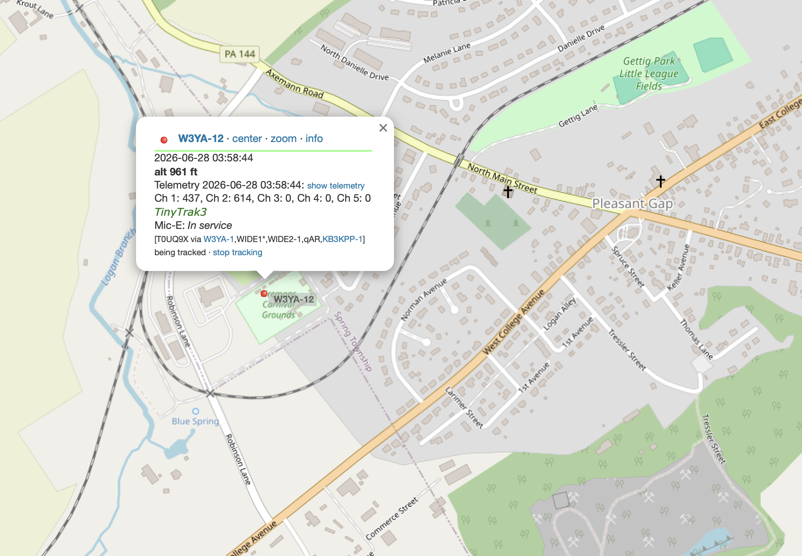
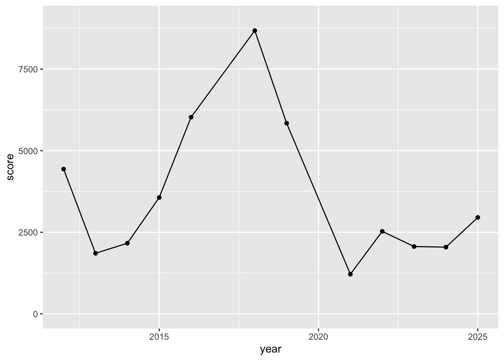
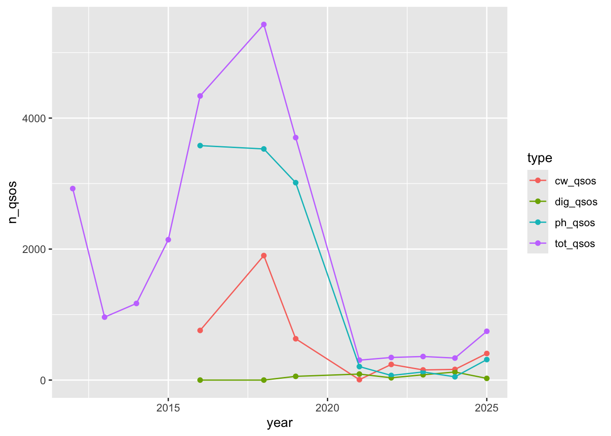
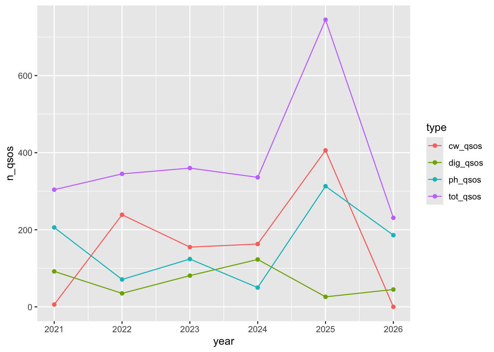
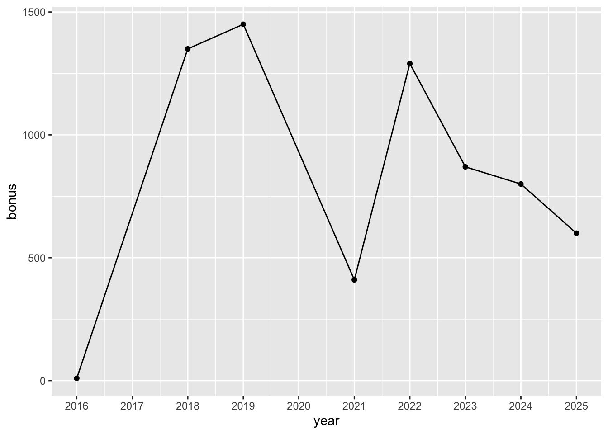
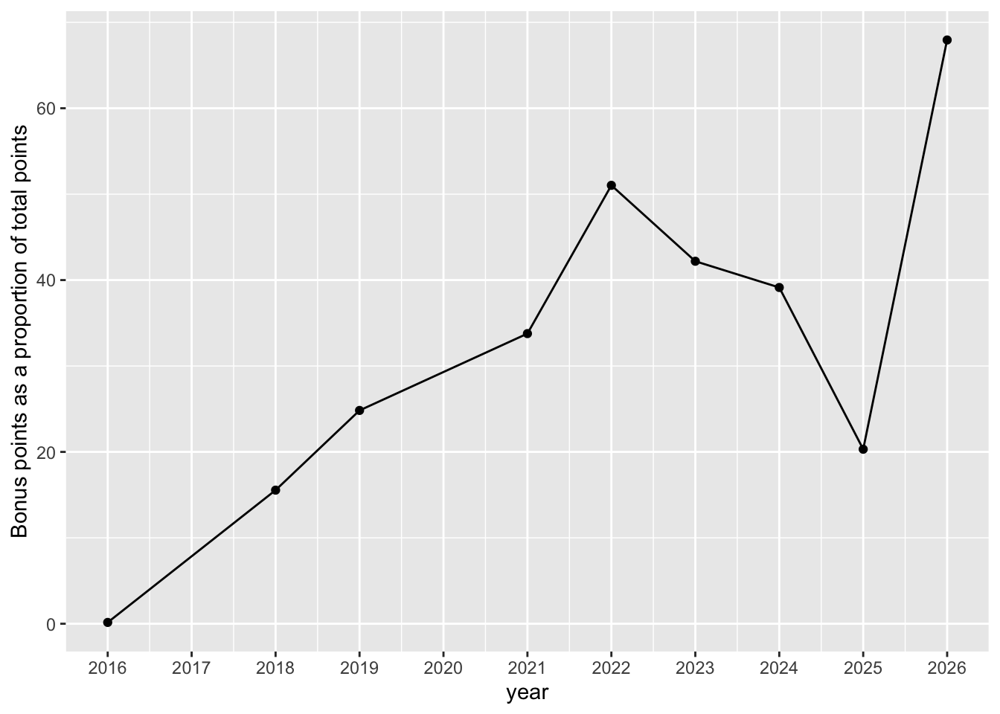

## Photos








## Data








## Bonus points





:::: {.columns}
::: {.column width=50%}
- Winlink message to ARRL Section Manager
- 10 Winlink messages
- Safety Officer
- Elected Official visit; agency official visit
- Social media
:::
::: {.column width=50%}
- Youth operator
- Web submission
- Info table
- Public location
- Educational activity
:::
::::


## On time and under budget

- Membership approved budget up to $1,000
- Expenses ~$700; several in-kind donations/contributions (K3CWP, K3JEG, W3TM, KD3AQC)

## It takes a village...

A huge thank you to

```{r}
#| echo: false

generate_callsign_url <- function(callsign="W3TM") {
  assertthat::is.string(callsign)
  paste0("<a href='https://www.hamqth.com/s.php?callsign=", callsign, "'>", callsign, "</a>")
}

setup <- c("W3TM", "W3EDP", "K3YV", "KD3CCO", "WA8MTZ", "N3LI", "KC3MVL", "KM3AJ", "KD3CCP", "K3CWP", "W3SWL")
food <- c("KD3AQC", "K3JEG", "KF0JZM", "KD3CPR")
bonus <- c("KB1BH", "N3IW")
ops <- c("WA7HUB", "KD3BHE", "K3ABR", "K3IWI")
gear <- c("K3JHG", "N3LI", "W3TM", "K3YV", "KD3CCO", "W3SWL", "N3LI")
visitors <- c("WB3AEI", "KC3JRV", "AC3V", "W3RPA", "KB3CTG")

hams <- c(setup, food, bonus, ops, gear, visitors) |> 
  unique() |> 
  sort()

data.frame(hams)|>
  dplyr::mutate(hams = generate_callsign_url(hams)) |>
  kableExtra::kbl(format = "html", escape = FALSE)
```

## Next year

- [Winter Field Day](https://winterfieldday.org), January 23-24, 2027
- ARRL Field Day, June 26-27, 2027.
