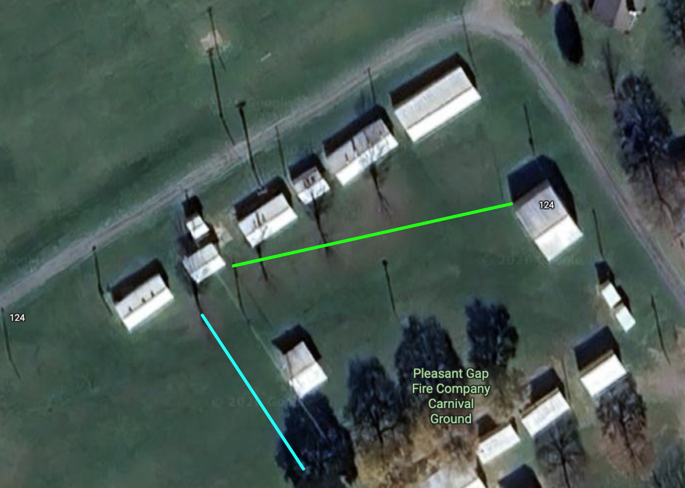
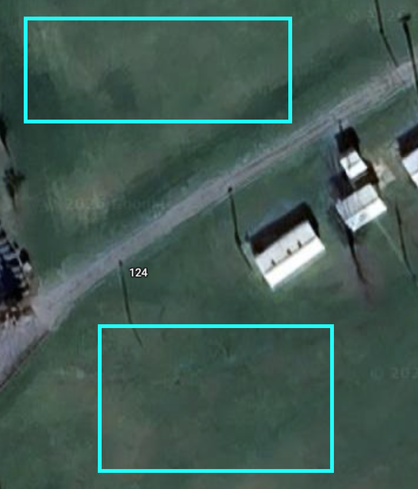

## About

This page describes some details about our Field Day stations.

## Class

Based on the results of the [survey](survey.qmd#visualizing), we plan to operate two (2) transmitters.

::: {.callout-note}
## Get on the Air (GOTA) station

On 2026-05-26 the Board discussed whether to mount a GOTA station this year.
We decided to use one of our transmitters specifically for helping new operators or inactive operators get on the air.
:::

We will operate at 100 W and use W3YA as our callsign.

## Radios

Our plan is to configure separate radios for phone, digital modes, and CW.
Radios configured for CW and digital modes have some special characteristics that make it more difficult to switch in the field.

### Station-1

- ICOM IC-7610 transceiver
- Mini PC with external display, keyboard, mouse
- Halibut Electronics audio interface?
- ICOM SM-50 mic
- Headset(s)
- Footswitch
- Power supply

### Station-2

- Yaesu FT-710 (loaned by K3JHG; W3TM has been testing)
- NARC2 Mini PC with external display, keyboard, mouse
- Mic
  - Yaesu hand mic
- Headset(s)
- Footswitch
- Power supply

## Filters

The club owns bandpass filters for 75m/80m, 40m, 20m, 15m, and 10m.
All radios will use bandpass filters on Field Day.

## Primary Antennas

{#fig-field-day-site}

### Primary EW ([green]{style="color: #00FF00;"}): 75/10m EFHW (loaned by K3YV)

- "Far" end mounted to top of flagpole
- "Near" (feedpoint) end connected to tree
- Support mast (loaned by W3EDP) in the middle
  - Military mast tripod
  - 3x (base) + 3-4 mast poles (12-16')
  - 3x sandbags
  - Paracord
- 50' RG-213 coax (UHF male/male)
  
### Primary NS ([cyan]{style="color: #00FFFF;"}): 40/10m EFHW (loaned by K3YV)

- "Far" end mounted to top of tree to the south
- "Near" (feedpoint) end connected to tree near the pavilion
- Support mast (loaned by K3YV or WA8MTZ) in the middle
  - Military mast tripod
  - 3x (base) + 3-4 mast poles (12-16')
  - 3x sandbags
  - Paracord
- 75' RG-213 coax (UHF male/male)

### Extra VHF/UHF

- Radio
  - IC-7100 (loaned by W3SWL)
- Antenna
  - Moxon (loaned by W3SWL)
- PC
  - W3TM mini-PC (loaned by W3TM)
    - Use NARC3 user account

## Backup/Experimental antennas

{#fig-field-day-antennas-backup}

### 6m Moxon (loaned by W3SWL)

- Mast/mount (W3SWL)
- Coax (W3SWL)

### Receive loop (loaned by W3TM)

- Mount
  - Military mast tripod (W3TM)
  - 3x (base) + 3-4 mast poles (12-16')
- Coax TBD

### Backup 40m/80m (loaned by W3TM)

- Mount
  - Military mast tripod (W3TM)
  - 3x (base) + 3-4 mast poles (12-16') 
- Coax TBD

### Kite 160m EFHW (KD3CCO)

### Portable antennas 

- Antennas
  - K3YV 10m vertical (loaned by W3TM)
- Coax TBD
- Mounts
  - Drive-on mount
  - Flagpole/trailer hitch mount
  
## Satellite antenna 1: Egg beaters (loaned by W3TM)

- Mount
  - Military mast tripod (W3TM)
  - 3x (base) + 2-3 mast poles (8-12')
- Coax
  - 2x RG-400
  - 2x patch cables
  